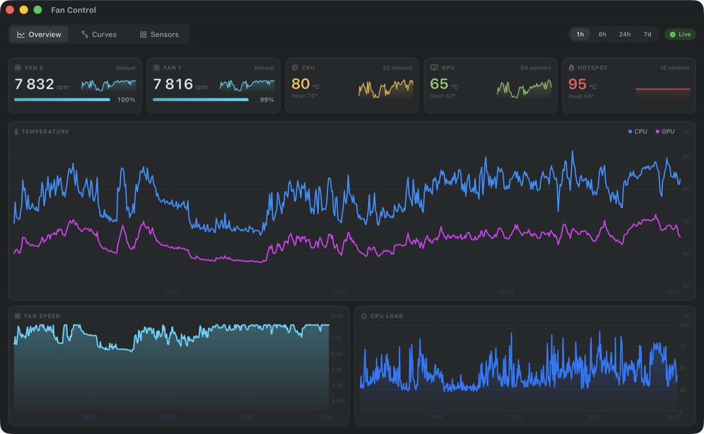
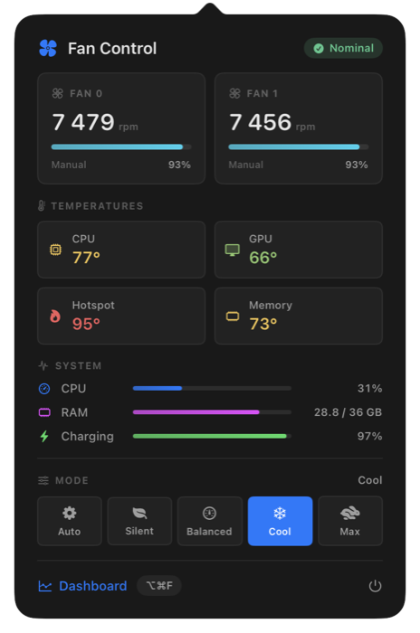
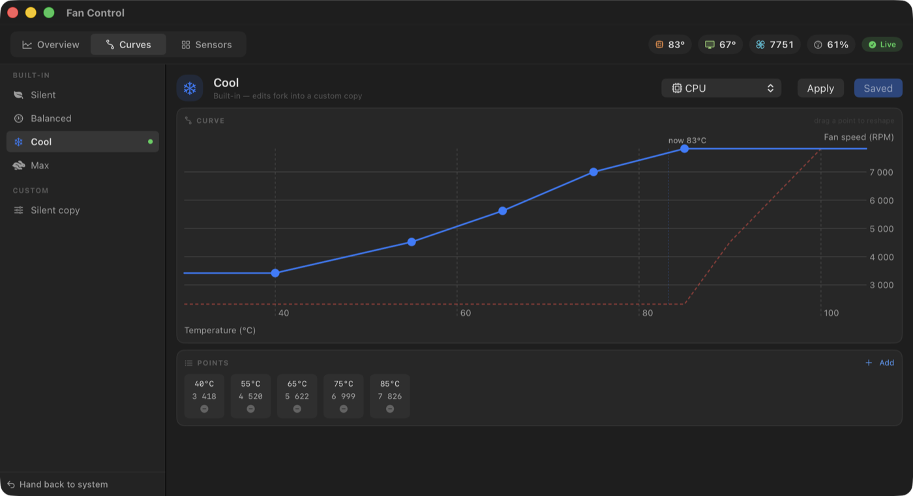
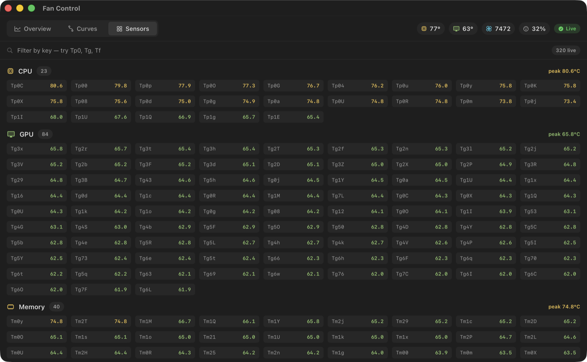

# Fan Control

Fan control and system monitoring for Apple Silicon Macs. Menu bar app, curve
engine, dashboard, and a CLI — talking to the SMC directly, no dependencies.



## Install

```bash
curl -fsSL https://raw.githubusercontent.com/adilkairolla/fan-control/main/scripts/bootstrap.sh | bash
```

Builds from source into `~/.fan-control`, installs the app and the helper, and
launches. Asks for your password once — only for the helper. Re-run it to
upgrade.

Prefer to read it first:

```bash
git clone https://github.com/adilkairolla/fan-control.git && cd fan-control && make up
```

Requires macOS 14+ on Apple Silicon and the Command Line Tools
(`xcode-select --install`). No Xcode, no Apple Developer account, no
third-party packages.

**Uninstall:** `make down` stops everything and hands the fans back to macOS.
`make uninstall` also removes it from disk.

## Updating

An update is a fast-forward of the source and a rebuild of whatever changed.
Three ways in, all doing the same thing:

- **In the app** — the ⬇ button in the menu bar popover. It opens Terminal, so
  you can watch the build and answer the password prompt if the helper changed.
  The app never contacts the network on its own; `git` does the checking, when
  you ask.
- **From the checkout** — `make update`, or `make update-check` to see what a
  pull would bring without applying it.
- **From nothing** — re-run the install one-liner. It updates an existing
  `~/.fan-control` rather than replacing it.

Only fast-forwards. Local commits or uncommitted edits stop the update with an
explanation rather than being merged, stashed or discarded on your behalf.

```
$ fanctl version
  helper  0.1.0 (47f3d8079)   2026-08-01
  app     0.1.0 (47f3d8079)   2026-08-01
```

The two halves are installed by different scripts and reported separately
because they can genuinely drift — an app rebuilt while the helper stayed
behind is a real state, and one you cannot diagnose if the tool insists there
is only one version. `make up` reconciles them.

## What it does

- **Monitors** ~320 temperature sensors, both fans, CPU/memory/battery and
  thermal pressure — **without root**
- **Controls** fans with temperature→RPM curves, hysteresis and slew limiting,
  or a pinned fixed RPM
- **Enforces a safety floor** under every curve that the UI can raise but never
  remove
- **Records history** to SQLite and charts it over 1h / 6h / 24h / 7d
- **⌥⌘F** opens the dashboard from anywhere

### Menu bar

Live temperature and fan speed in the bar; click for the full picture. Built-in
profiles and your own custom curves are both one click away.



### Curves

Drag points to reshape. The red dashed line is the safety floor — a curve can
run above it, never below.



### Sensors

Every SMC temperature key on the machine, grouped and searchable.



## CLI

```bash
fanctl status            # fans, temps, load
fanctl watch             # live view
fanctl sensors cpu       # every CPU sensor
fanctl profile Silent    # activate a curve
fanctl set 4000          # pin a fixed RPM
fanctl auto              # hand control back to macOS
fanctl safety            # show the enforced floor
fanctl version           # what's installed, and how to update it
fanctl doctor            # why fan speed or control isn't working
fanctl history 3600 > out.csv
```

`doctor` is the one to run when the menu bar shows no fan speed, or a preset
does nothing. It needs neither root nor the daemon — SMC reads are
unprivileged — and reports the machine, what's installed, the fan keys it found
with their types and current values, and a plain sentence about what that adds
up to. Paste its output into an issue and there is nothing left to ask.

```
$ fanctl status
  mode: Curve · Cool   thermal: nominal

  FANS
    fan 0  7447  RPM  [██████████████████████··] 93 %  [Manual]
    fan 1  7434  RPM  [██████████████████████··] 92 %  [Manual]

  TEMPERATURES
    CPU              78.5  °C max   72.5  °C mean   (23 sensors)
    GPU              65.2  °C max   62.6  °C mean   (84 sensors)
    Hotspot          95.1  °C max   65.3  °C mean   (18 sensors)
```

## How it works

```
┌─ FanControl.app (you) ─────────┐      ┌─ fand (root) ─────────────┐
│  menu bar item + dashboard     │◄────►│  SMC read/write           │
│  curve editor, charts          │ JSON │  curve engine + safety    │
│  ⌥⌘F global hotkey             │ over │  SQLite history           │
└────────────────────────────────┘ sock └───────────────────────────┘
                                   ▲
                          fanctl ──┘
```

Only `fand` runs as root, because only SMC **writes** need privileges. Reading
does not — as a normal user every read succeeds and only writes come back
`kIOReturnNotPrivileged` (`0xE00002C1`). There is no entitlement or TCC prompt
that changes this; Macs Fan Control ships a privileged helper for the same
reason.

So without the daemon the app opens its own SMC handle and reads everything
in-process (`FanKit/LocalMonitor.swift`). It is fully useful with zero
installation — the daemon is what adds *control*.

| Path | |
|---|---|
| `Sources/FanKit` | SMC access, sensor catalog, curve model, IPC types |
| `Sources/fand` | the privileged daemon |
| `Sources/fanctl` | CLI client |
| `Sources/FanControlApp` | SwiftUI menu bar app and dashboard |

## Safety model

Taking manual control means Apple's controller is no longer managing the fans,
so three failure modes get explicit handling.

**The daemon dies holding the fans.** The SMC has no deadman timer — it keeps
the last commanded target indefinitely. `fand` restores auto mode on SIGTERM,
SIGINT, SIGHUP, SIGQUIT and `atexit`; launchd restarts it with `KeepAlive`; and
it reasserts a known state on every start.

**A curve runs too cool for the load.** The daemon computes

```
commanded = max(user_curve(temp), safety_floor(die_temp))
```

so a curve can only ever spin fans *faster* than the floor. The floor is not
slew-limited: it responds instantly while user curves ramp.

**The machine sleeps, or the lid shuts.** Both hand the fans back to macOS, and
— this is the part that matters — *latch* them there. macOS takes about five
seconds between the `IORegisterForSystemPower` sleep notification and the SoC
actually going down, and the control loop runs at 1 Hz, so a hand-back that
simply wrote the SMC and returned got re-armed five times over before the
machine went under. It slept with the fans pinned to the curve's last target,
and since the SMC has no deadman they kept spinning inside a closed bag. The
hand-back now runs *on the control loop's own queue*, so no tick can undo it.

The lid rule stands on its own: with the lid shut, the fans are Apple's. That
also covers the wakes nobody sees — macOS wakes a sleeping Mac every twenty
minutes or so for maintenance, and without it the curve would spin the fans up
on each one. The cost is that a Mac used in clamshell on an external display
gets Apple's fan control rather than yours; temperatures stay live either way.

The floor keys off `max(CPU, GPU)` die temperature, deliberately **not** the
`Tf*` hotspot group — on this hardware those read 93–95 °C under ordinary heavy
load, so keying safety off them would peg the fans permanently.

## SMC notes

Things that cost time to work out, recorded so they don't have to be
rediscovered:

- The request struct is 80 bytes and its integer fields are **native
  little-endian**. Marshalling them big-endian makes every call fail silently.
- Data payloads are **big-endian for integers but little-endian for `flt `**.
- The fan mode key is **`F0md`** — lowercase `d` — on this hardware. Every
  Intel-era sample uses `F0Md`, which does not exist here. Both are probed,
  because neither spelling is universal.
- Fan targets are `flt ` (IEEE float) here, and `fpe2` fixed-point on older
  Macs. Read the type the key declares rather than assuming one.
- Type names are four-character codes, so short ones are space-padded: `ui8 `
  and `flt `, but `fpe2` and `ui16`. Matching the padded string is a bug
  waiting for whichever type you forget to pad.
- **Nothing above is a property of "Apple Silicon" — it is a property of the
  Mac it was measured on.** Fan keys must be resolved against the running
  machine, and every one except `F<n>Ac` treated as optional. Demanding all
  five made a single unrecognised key erase the fan from `readAll()` entirely:
  fan speed vanished from the whole UI and the presets silently did nothing,
  on hardware that was working fine. `fanctl doctor` exists so that failure
  reports a key name instead of a blank space.
- Writing `F0Tg` and reading it straight back returns the **old** value; the
  register is eventually consistent. Confirm control took effect by watching
  `F0Ac` converge instead.

Developed and verified on a MacBook Pro M5 Max (Mac17,7), macOS 26.5: 2 fans,
2317–7826 RPM, 3738 SMC keys, 359 in the `T*` namespace.

## Tests

```bash
make test
```

Command Line Tools ship neither XCTest nor swift-testing, so the suite is a
plain executable. 98 checks covering curve interpolation, the safety floor,
hysteresis and slew limiting, profile stability, IPC round-trips, lid
detection, fan key resolution, and live unprivileged SMC reads.

## License

MIT
